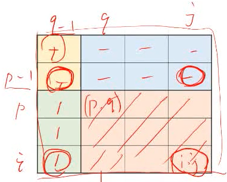
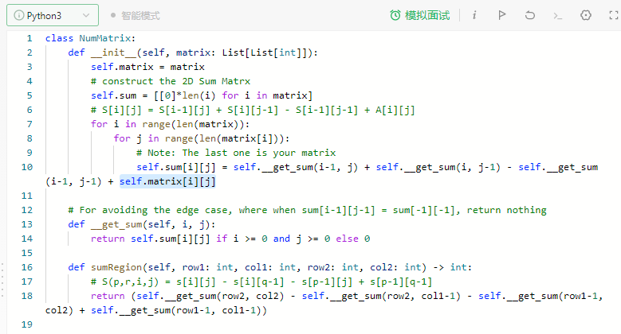
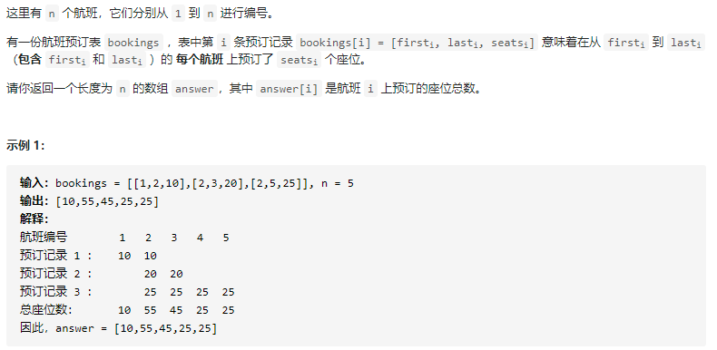

[TOC]

# 第2课 | 前缀和、差分、双指针扫描

## 1 前缀和

### 基本知识点

- 一维数组A
  - 
  - 通常将其下标变为1～n，在前面补一个0，防止计算S[r]-S[l-1]时越界
  - `nums = [0] + nums;`
- ==前缀和数组S==：
  - $s[i]=\sum^i_{j=1}A[j]$ 	# O(n), 遍历数组A的方式来求前i个数之和
  - $s[i] = s[i-1] + A[i]$ # O(1), 即可求得前i个数之和
- 子段和——A中第l个数到第r个数的和
  - $sum(l,r) = \sum^r_{i=l}A[i]=S[r]-S[l-1]$
- A中都是非负数时，前缀和数组S单调递增
- 固定外层循环变量，考虑内层满足什么条件

### 模板

Python前n项数组和模板

```python
nums = [0] + nums
s = [0]*len(nums)
for i in range(len(nums)):
	s[i] = s[i-1] + nums[i]
```

C++模板

```C++
// 前缀和模板
vector<int> input;
vector<int> s(input.size() + 1, 0);
for (int i = 0; i <= s.size() + 1; i++){
    s[i+1] = s[i] + input[i];
}
```
### 实战例题

- 1248. 统计「优美子数组， https://leetcode-cn.com/problems/count-number-of-nice-subarrays/  ==> 老师的模板，https://shimo.im/docs/R8SmKYMs7KsfK45Y/read

**一定要记得判断越界**

#### 1248-统计【优美子数组】

https://leetcode-cn.com/problems/count-number-of-nice-subarrays/

Question: 

- 给你一个整数数组 `nums` 和一个整数 k。如果某个 连续 子数组中恰好有 k 个奇数数字，我们就认为这个子数组是「优美子数组」。请返回这个数组中「优美子数组」的数目。

- 示例 1：

  > 输入：nums = [1, 2, 3], k = 1
  > 输出：4
  > 解释：包含 4 个奇数的子数组是 [1], [3], [1, 2], [2, 3]。

Answer:

两变量循环，首先分离

- 根据奇偶性将元素转化为0/1
- 判断优美子数->>有多少子段和为k
- 前缀和加count计数的方式
- 滑动窗口

```python
class Solution:
    def numberOfSubarrays(self, nums: List[int], k: int) -> int:
        """
            6/23: 第一次做思路：暴力解题，A[i, j], if i<=z<=j, and z%2==0, k+=1 ==》 O(m*n) 时间
        """
        # nums = [1, 1, 2, 1, 1]  # 取2的模（%）
        # nums = [1, 1, 0, 1, 1]  # 只有1和0
        # 把统计k的奇数，变成了统计子段和是k

        # 先把r,l两个循环变量分离。
        # for r = 1 ~ n:
        #     for l = 1 ~ r: # 取 [l,r]这个子段
        #         if s[r] - s[l-1] == k:
        #             ans+=1
       
        """
        6/23: 优化后的思路：
           	- 用前缀和公式==》然后再转化成统计问题来优化
            复杂度分析：
            - 时间复杂度：O(N)O(N)，这里 NN 是数组的长度；
            - 空间复杂度：O(N)O(N)。
        """
        # 计算出数组nums的前缀和,S
        nums_copy = nums
        nums = [i%2 for i in nums]
        nums = [0] + nums
        s = [0]*len(nums)
        for i in range(len(nums)):
            s[i] = s[i-1] + nums[i]

        # 先固定外层循环变量，考虑内存满足什么条件
        # 考虑数学模型 ==> 对于每个r(1~n),考虑有几个l(1~r),能使得s[r]-s[l-1]=k 
        #
        # 实现上的优化(or 问题的转化):
        # 对于每个r(1~n),考虑有几个l(0~r-1),能使得s[r]-s[l]=k  
        #                                         i    j 
        # 对于每个i(1~n),考虑有几个j(0~i-1),能使得s[i]-s[j]=k  
        # 对于每个i(1~n),考虑有几个j(0~i-1),能使得s[j]=s[i]-k
        # 即，在一个数组（s）中统计“某个数S[i]"的数量，e.g., 
        # s = [0, 1, 1, 2]
        # count = [1, 1, 2]
        # 1个0，1个1，1个2
        # 
        # 这里使用的是array来计数，但你也可以用HashMap来记
        count = [0] * len(s)
        for i in range(0, len(s)):  # for i = 0 ~ n
            count[s[i]]+=1

		# 对于每个i(1~n),考虑有几个j(0~i-1),能使得s[j]=s[i]-k（这就是统计计算，不用理解)
        ans = 0
        for i in range(1, len(s)):
            if s[i]-k >=0:
                ans+=count[s[i]-k]
        return ans
    
        # Note1：这方法的亮点就在用利用了统计数的方法，将时间复杂度从O(n^2) reduced to O(n)
        # Note2: 因为这里的数组都是0or1, 所以sum[i]的值最大不会超过n, 也就不用担心count[S[i]]>len(s)，out of range的问题。但如果sum[i]的值很大的话，再用数组计数的方式，数组会很稀疏，空间使用率就不高了。
```

好的题解：

- 【动画模拟】一文秒杀七道题, https://leetcode-cn.com/problems/count-number-of-nice-subarrays/solution/de-liao-wo-ba-qian-zhui-he-gei-ba-de-gan-ymzz/

知识点总结：

- 如何遍历得到前缀和数组？

```python
for i in range(len(nums)):
    presum[i+1] = nums[i] + presum[i]
```


## 1.2 二维前缀和
### 基本知识点

- 二维数组A
  
  - 矩阵里S[i,j]的值： 就是已[i,j]为右下角，上方所有单位的和
  
- 前缀和数组
  - 
  - $s[i][j]= \sum^i_{x=1} \sum^j_{y=1}A[x][y]=s[i-1][j]+s[i][j-1]-s[i-1][j-1]+A[i][j]$

- 子矩阵和——$(p,q)$到$(ij)$

  - 
  - $$
    sum(p,q,i,j)=\sum^i_{x=p}\sum^j_{y=q}A[x][y]=s[i][j]-s[i][q-1]-s[p-1][j]+s[p-1][q-1]
    $$

### 实战例题：

- 304. 二维区域和检索 - 矩阵不可变， https://leetcode-cn.com/problems/range-sum-query-2d-immutable/ ==》老师给的代码模板，https://shimo.im/docs/vufyatCV6Vo1imT9/read

#### 304. 二维区域和检索 - 矩阵不可变

Question:


Answer:



Note: 把图记住，理解好就行了，不用死记公式的

## 2. 差分

### 基本知识点

- 一维数组A

- 差分数组B: $B_1=A_1,B_i=A_i-A_{i-1}(2<=i<=n)$

- B，A，S三个数组的关系和特点（见下图):

  1. S to A的关系即为A to B 的关系 (S是A的前缀和，A是B的前缀和)

  2. B -> A 的关系等价于A -> S的关系，（即B是A的差分数组，A是S的差分数组, 你对A求差分就得到B，对S求差分就可得到A)

  - 

### 差分的作用

讲**前缀和**时，要求的时一个数组subarray之和 ==》只求值，不修改 ==》然而，**差分**用于一些问题是要求修改数组之后，再做求和之类的运算 ==》查用于航班，订票之类的应用。

题目：求 array A经过多次变化后的，将最终变化值赋值于B，and return.

比如: B[1] = A[0][1] + A[1][1] = 1 ==》但如过这样暴力计算的话，我们需要遍历整个matrix，需要O(m*n)的时间

- 

- Answer:
  - 用差分数组的Idea: 对一数组求差分==》 再求其前缀和 ==》找回原数组。
  - 比如，A数组有类是于transformation matrix，需要进行差分的数 ==》 merge all change for matrix A, we will have B = A[0]+A[2] ==》 return 前缀和(B)
  - 注意到，对A[l, r] 数加 d, then we will have B[l]=B[l]+d, B[l+1, r]=0, and B[r+1] = B[r]-d. （就是B数组l位置上的数回加d，(l, r)中间会为0，然后B[r]位置会减d). 
  - 

### 实战例题

- 1109. 航班预订统计，https://leetcode-cn.com/problems/corporate-flight-bookings/ ==> 老师给的代码模板，https://shimo.im/docs/IuXdO0ink38n0gqv/read

#### 1109. 航班预订统计

Question:



Answer:


### 思考：

- 差分这些操作对解决题目的影响是什么？why work?
  - Intuition: Because we are making some option on a subarray, from index l to r. 可以看到这些操作都是重复的，差分的作用就像是压缩信息，将这一系列的操作用一种简单的方法记录下来，and carry over to the end。最后通过求前缀和的方法将最终的影响累加起来，作为output。
  - 如如下矩阵，第一组的影响
    - 


==不理解公式？理解下面三句话==

- 任何对于区间的操作，可以转化为两个关键点（事件）
- 事件的影响 effect 从l开始，到r+1结束。开始为+，结束为-
- 最后累加影响为coEffect数组，然后求前缀和数组就是输出了


```c++
// 注意 effcet 可能在5+1结束
编号         1       2       3       4       5      
thing1      10             -10
thing2              20             -20
thing3              25                             -25
coEffect    10      45     -10     -20       0
ans         10      55      45      25       25
```

==还不理解？背下面的模板==

```C++
// 输入things = [l, r, effect]
vector<int> corpFlightBookings(vector<vector<int>>& things, int n) {
    vector<int> coEffect(n + 2, 0); // 累加影响数组,things是从1开始的。
    for (auto& thing : things){
        int l = thing[0];
        int r = thing[1];
        int effect = thing[2];
        coEffect[l] += effect;
        coEffect[r + 1] -= effect;
    }
    vector<int> ans(n, 0); // 前缀和数组
    ans[0] = coEffect[1] // 迭代公式需要用到i-1防止越界，先定义好ans[0]
    for (int i = 1; i <= n; i++){
        ans[i] = ans[i-1] + coEffect[i];
    }
    return ans;
}
```

``` java
 public int[] corpFlightBookings(int[][] bookings, int n) {
        int[] delta = new int[n + 2]; // 差分要开0~n+1
        Arrays.fill(delta, 0);
        for (int[] booking : bookings) {
            int fir = booking[0];
            int last = booking[1];
            int seats = booking[2];      // 差分模板
            delta[fir] += seats;
            delta[last + 1] -= seats;
        }
        int[] a = new int[n + 1]; // 0~n
        a[0] = 0;    // 1~n    
        for (int i = 1; i <= n; i++) a[i] = a[i - 1] + delta[i];
        // 0~n-1
        int[] ans = new int[n];
        for (int i = 1; i <= n; i++) ans[i - 1] = a[i];
        return ans;
    }

```

## 3. 双指针扫描，滑动窗口
### 3.1 双指针扫描
用于解决一类**基于“子段”的统计问题**
子段：数组中连续的一段（下标范围可以用一个闭区间来表示）

这类题目的朴素做法都是两重循环的枚举，枚举左端点$l$，右端点$r(l<r)$
优化手法都是找到枚举中的冗余部分，将其去除

### 使⽤条件
- 1. 滑动窗⼝ (90%)
- 2. 时间复杂度要求 O(n) (80%是双指针)
- 3. 要求原地操作,只可以使⽤交换，不能使⽤额外空间 (80%)
- 4. 有⼦数组 subarray /⼦字符串 substring 的关键词 (50%)
- 5. 有回⽂ Palindrome 关键词(50%)

**优化策略通常有：**
- 固定右端点，看左端点的取值范围
  - 例如左端点的取值范围是一个前缀，可以用“前缀和”等算法维护前缀信息
- 移动一个断点，看另一个端点的变化情况
  - 例如一个端点跟随另一个端点单调移动，类似与滑动窗口
    - 此时考虑”双指针“扫描
  - 或者左右端点相向/背驰移动
  
- 模板

``` java

 // 相向双指针(patition in quicksort)
    public void patition(int[] A, int start, int end) {
        if (start >= end) {
            return;
        }
        int left = start, right = end;
        // key point 1: pivot is the value, not the index
        int pivot = A[(start + end) / 2];
        // key point 2: every time you compare left & right, it should be
        // left <= right not left < right
        while (left <= right) {
            while (left <= right && A[left] < pivot) {
                left++;
            }
            while (left <= right && A[right] > pivot) {
                right--;
            }
            if (left <= right) {
                int temp = A[left];
                A[left] = A[right];
                A[right] = temp;
                left++;
                right--;
            }
        }
        // 背向双指针
        left = position;
        right = position + 1;
        while (left >= 0 && right < length) {
            if (可以停下来了) {
                break;
            }
            left--;
            right++;
        }


        // 同向双指针
        int j = 0;
        for (int i = 0; i < n; i++) {
            // 不满⾜则循环到满⾜搭配为⽌
            while (j < n && i 到 j之间不满⾜条件){
                j += 1;
            }
            if (i 到 j之间满⾜条件){
                处理i，j这次搭配
            }
        }

        // 合并双指针
        ArrayList<Integer> merge (ArrayList < Integer > list1, ArrayList < Integer > list2){
            // 需要 new ⼀个新的 list，⽽不是在 list1 或者 list2 上直接改动
            ArrayList<Integer> newList = new ArrayList<Integer>();
            int i = 0, j = 0;
            while (i < list1.size() && j < list2.size()) {
                if (list1.get(i) < list2.get(j)) {
                    newList.add(list1.get(i));
                    i++;
                } else {
                    newList.add(list2.get(j));
                    j++;
                }
            }

            // 不需要if(i < list1.size())，直接 while 即可
            while (i < list1.size()) {
                newList.add(list1.get(i));
                i++;
            }
            while (j < list2.size()) {
                newList.add(list2.get(j);
                j++;
            }
            return newList;
        }
    }


```


## 实战

**一定要记得判断越界**

### 53 最大子序和

https://leetcode-cn.com/problems/maximum-subarray/

- 方法1:动态规划
- 方法2:前缀和s、前缀和最小值minist、子区间最大值ans
  - 关键的比较`ans = max(ans, s[i] - minist[i - 1]);`

### 167 两数之和II-输入有序数组

https://leetcode-cn.com/problems/two-sum-ii-input-array-is-sorted/

- 固定一端，看另一断的变化
- 和不变，l减小,r增大。夹逼
- for r : 0~n-1
  - 只要lr没相遇，并且l+r大于target，就增大l，直到lr相遇就下一次循环，如果l+r等于target了，就返回{i+1, j+1}//因为题目要求从1开始计数所以+1

### 1 两数之和-输入无序数组

https://leetcode-cn.com/problems/two-sum/

- 新开二元组记录每个数和对应下标
- 排序——用上一题的模板，返回两个数
- 通过两个数去二元组插下标

### 15 三数之和

https://leetcode-cn.com/problems/3sum/

- 两数之和等于-i
- 一定要注意，题目要求不能重复
- 因此固定i调用两数只和的时候，要注意顺序`i<l<j`才可以；
- 这一题要求返回所有的数组，所以两数和定义`vector<vector<int>>`
- 注意对最后的输出去重，因为可能输入数组又重复元素

### 11 盛最多水的容器

https://leetcode-cn.com/problems/container-with-most-water/

- 啊
